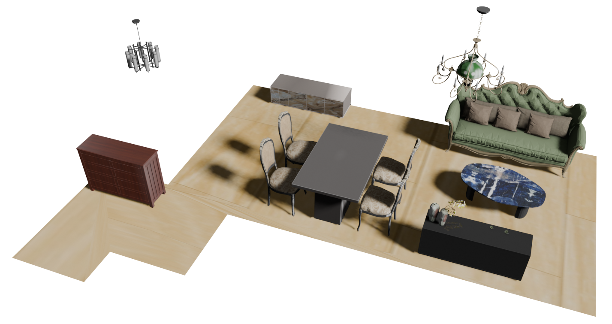

# Awesome-Indoor-Scene-Synthesis [](https://github.com/sindresorhus/awesome)
[](https://hits.seeyoufarm.com)

A curated list of awesome Indoor Scene Synthesis papers.
<div style="text-align: center">

</div>

## Table of Contents

- [Papers](#papers)
- [Datasets](#Datasets)

## Papers

### 3D Scene synthesis
<details open>
<summary>Single Mesh Generation</summary>

- [SceneFactor: Factored Latent 3D Diffusion for Controllable 3D Scene Generation](https://arxiv.org/abs/2412.01801) | arxiv 2024 |[github](https://github.com/alexeybokhovkin/SceneFactor)  | [project](https://alexeybokhovkin.github.io/scenefactor/)

</details>
 
<details open>
<summary>Compositional Mesh Generation</summary>

- [MIDI: Multi-Instance Diffusion for Single Image to 3D Scene Generation](https://arxiv.org/abs/2412.03558) | arxiv 2024 | [github](https://huanngzh.github.io/MIDI-Page/) | [project](https://huanngzh.github.io/MIDI-Page/)
- [Disentangled 3D Scene Generation with Layout Learning](https://arxiv.org/abs/2402.16936), Epstein, et al., arxiv 2024 | [bibtex](./citations/disentangled.txt)
- [GALA3D: Towards Text-to-3D Complex Scene Generation via Layout-guided Generative Gaussian Splatting](https://arxiv.org/abs/2402.07207) | arxiv 2024 | [project](https://gala3d.github.io/)  [](https://github.com/VDIGPKU/GALA3D) 
- [SceneWiz3D: Towards Text-guided 3D Scene Composition](https://arxiv.org/abs/2312.08885), Zhang et al., arxiv 2023 | [bibtext](./citations/scenewiz3d.txt)  [](https://github.com/zqh0253/SceneWiz3D)
- [Compositional 3D Scene Generation using Locally Conditioned Diffusion](https://arxiv.org/abs/2303.12218), arxiv 2023 | [project](https://ryanpo.com/comp3d/) 
- [GraphDreamer: Compositional 3D Scene Synthesis from Scene Graphs](https://arxiv.org/abs/2312.00093), Gao et al., arxiv 2023 | [github](https://github.com/GGGHSL/GraphDreamer) | [bibtext](./citations/graphdreamer.txt)
</details>
</details>

<details open>
<summary>applying LLM</summary>

- [FirePlace: Geometric Refinements of LLM Common Sense Reasoning for 3D Object Placement](https://arxiv.org/pdf/2503.04919) | arxiv 2025
- [HSM: Hierarchical Scene Motifs for Multi-Scale Indoor Scene Generation](https://arxiv.org/pdf/2503.16848) | 3DV 2025 | [project](https://3dlg-hcvc.github.io/hsm/)
- [WorldCraft: Photo-Realistic 3D World Creation and Customization via LLM Agents](https://arxiv.org/pdf/2502.15601) | arxiv 2025
- [MMGDreamer: Mixed-Modality Graph for Geometry-Controllable 3D Indoor Scene Generation](https://arxiv.org/pdf/2502.05874) | AAAI 2025 | [code](https://github.com/yangzhifeio/MMGDreamer) | [project](https://yangzhifeio.github.io/project/MMGDreamer/) 
- [The Scene Language: Representing Scenes with Programs, Words, and Embeddings](https://arxiv.org/abs/2410.16770) | [github](https://ai.stanford.edu/~yzzhang/projects/scene-language/)  | [project](https://ai.stanford.edu/~yzzhang/projects/scene-language/)
- [Open-Universe Indoor Scene Generation using LLM Program Synthesis and Uncurated Object Databases](https://arxiv.org/pdf/2403.09675) | arxiv 2024 
- [LAYOUTVLM: Differentiable Optimization of 3D Layoutvia Vision-Language Models](https://arxiv.org/pdf/2412.02193) | CVPR 2025  | [github](https://github.com/sunfanyunn/LayoutVLM) | [project](https://ai.stanford.edu/~sunfanyun/layoutvlm/)
- [Chat2Layout: Interactive 3D Furniture Layout with a Multimodal LLM](https://arxiv.org/pdf/2407.21333) | arxiv 2024
- [LLplace: The 3D Indoor Scene Layout Generation and Editing via Large Language Model](https://arxiv.org/abs/2406.03866) | arxiv 2024 
- [SceneCraft: An LLM Agent for Synthesizing 3D Scenes as Blender Code](https://arxiv.org/abs/2403.01248) | ICML 2024
- [I-Design: Personalized LLM Interior Designer](https://arxiv.org/abs/2404.02838), arxiv 2024 | [github](https://github.com/atcelen/IDesign/?tab=readme-ov-file) | [project](https://atcelen.github.io/I-Design/)
- [GALA3D: Towards Text-to-3D Complex Scene Generation via Layout-guided Generative Gaussian Splatting](https://arxiv.org/abs/2402.07207) | arxiv 2024 | [github](https://github.com/VDIGPKU/GALA3D) | [project](https://gala3d.github.io/)
- [SceneTeller: Language-to-3D Scene Generation](https://arxiv.org/pdf/2407.20727) | arxiv 2024 | [project](https://sceneteller.github.io/)
- [Holodeck: Language Guided Generation of 3D Embodied AI Environments](https://arxiv.org/abs/2312.09067) | arxiv 2023| [github](https://github.com/allenai/Holodeck) | [project](https://yueyang1996.github.io/holodeck/)
- [AnyHome: Open-Vocabulary Generation of Structured and Textured 3D Homes](https://arxiv.org/abs/2312.06644) | arXiv 2023 | [github](https://github.com/FreddieRao/anyhome_github) | [project](https://freddierao.github.io/AnyHome/)
- [LayoutGPT: Compositional Visual Planning and Generation with Large Language Models](https://arxiv.org/abs/2305.15393), arxiv 2023| [github](https://github.com/weixi-feng/LayoutGPT) | [project](https://layoutgpt.github.io/)
- [3D-GPT: PROCEDURAL 3D MODELING WITH LARGE LANGUAGE MODELS](https://arxiv.org/pdf/2310.12945) | [project](https://chuny1.github.io/3DGPT/3dgpt.html)

</details>


<details open>
<summary>Model Training without Scene Graph</summary>

- [Learning Object Placement Programs for Indoor Scene Synthesis with Iterative Self Training](https://www.arxiv.org/abs/2503.04496) | arxiv 2025
- [Mixed Diffusion for 3D Indoor Scene Synthesis](https://arxiv.org/pdf/2405.21066) | arxiv 2024 | [github](https://github.com/MIT-SPARK/MiDiffusion?tab=readme-ov-file) 
- [RoomDesigner: Encoding Anchor-latents for Style-consistent and Shape-compatible Indoor Scene Generation](https://arxiv.org/abs/2310.10027), Zhao et al., 3DV 2024 | [github](https://github.com/zhao-yiqun/RoomDesigner) | [bibtext](./citations/roomdesigner.txt)
- [Mixed Diffusion for 3D Indoor Scene Synthesis](https://arxiv.org/abs/2405.21066) | arxiv 2024 | [github](https://github.com/MIT-SPARK/MiDiffusion)
- [Mixed Diffusion for 3D Indoor Scene Synthesis](https://arxiv.org/pdf/2405.21066) | arxiv 2024 | [github](https://github.com/MIT-SPARK/MiDiffusion?utm_source=catalyzex.com)
- [PhyScene: Physically Interactable 3D Scene Synthesis for Embodied AI](https://arxiv.org/abs/2404.09465) | CVPR 2024 | [github](https://github.com/PhyScene/PhyScene/tree/main) |[project](https://physcene.github.io/)
- [ATISS: Autoregressive Transformers for Indoor Scene Synthesis](https://arxiv.org/pdf/2110.03675) | NIPS 2021 | [github](https://github.com/nv-tlabs/ATISS) | [project](https://research.nvidia.com/labs/toronto-ai/ATISS/)
- [DiffuScene: Denoising Diffusion Models for Generative Indoor Scene Synthesis](https://arxiv.org/abs/2303.14207) | arXiv 2024 | CVPR 2024 | [github](https://github.com/tangjiapeng/DiffuScene) | [project](https://tangjiapeng.github.io/projects/DiffuScene/)
- [Learning 3D Scene Priors with 2D Supervision](https://arxiv.org/abs/2211.14157) | CVPR 2023 | [github](https://github.com/yinyunie/ScenePriors) | [peoject](https://yinyunie.github.io/sceneprior-page/)
- [LEGO-Net: Learning Regular Rearrangements of Objects in Rooms](https://arxiv.org/pdf/2301.09629) | CVPR 2023 | [github](https://github.com/QiuhongAnnaWei/LEGO-Net) | [project](https://ivl.cs.brown.edu/research/lego-net.html)
- [CLIP-Layout: Style-Consistent Indoor Scene Synthesis with Semantic Furniture Embedding](https://arxiv.org/abs/2303.03565) | arXiv 2023
- [Learning 3D Scene Priors with 2D Supervision](https://arxiv.org/abs/2211.14157) | CVPR 2023 | [github](https://github.com/yinyunie/ScenePriors) | [project](https://yinyunie.github.io/sceneprior-page/)
- [SceneFormer: Indoor Scene Generation with Transformers](https://arxiv.org/abs/2012.09793) | 3DV 2021 | [github](https://github.com/cy94/sceneformer) | [project](https://xinpeng-wang.github.io/sceneformer/)
- [Fast and Flexible Indoor Scene Synthesis via Deep Convolutional Generative Models](https://arxiv.org/abs/1811.12463) | CVPR 2019
- [Scene Synthesis via Uncertainty-Driven Attribute Synchronization](https://arxiv.org/abs/2108.13499) | ICCV 2021 | [github](https://github.com/brownvc/fast-synth)
</details>


<details open>
<summary>Model Training with Scene Graph</summary>

- [MMGDreamer: Mixed-Modality Graph for Geometry-Controllable 3D Indoor Scene Generation](https://arxiv.org/pdf/2502.05874) | AAAI 2025 | [code](https://github.com/yangzhifeio/MMGDreamer) | [project](https://yangzhifeio.github.io/project/MMGDreamer/) 
- [EcoScene: Indoor Scene Generation via Information Echo over Scene Graph Diffusion](https://arxiv.org/abs/2405.00915) | ECCV 2025 | [github](https://github.com/ymxlzgy/echoscene) | [project](https://sites.google.com/view/echoscene)
- [InstructScene: Instruction-Driven 3D Indoor Scene Synthesis with Semantic Graph Prior](https://arxiv.org/abs/2402.04717) | ICLR 2024 | [github](https://github.com/chenguolin/InstructScene) | [project](https://chenguolin.github.io/projects/InstructScene/)
- [CommonScenes: Generating Commonsense 3D Indoor Scenes with Scene Graph Diffusion](https://arxiv.org/abs/2305.16283) | NIPS 2023 | [github](https://github.com/ymxlzgy/commonscenes) | [project](https://sites.google.com/view/commonscenes)
- [3D Scene Diffusion Guidance using Scene Graphs](https://arxiv.org/abs/2308.04468) | arXiv 2023
- [SceneGraphNet: Neural Message Passing for 3D Indoor Scene Augmentation](https://arxiv.org/abs/1907.11308) | ICCV 2019
</details>

<details open>
<summary>Using 2D Prior</summary>
 
- [Lay-A-Scene: Personalized 3D Object Arrangement Using Text-to-Image Priors](https://arxiv.org/abs/2406.00687) | arxiv 2024 | [project](https://lay-a-scene.github.io/)
 </details>

<details open>
<summary>Procedure / Human Design Rules</summary>
 
- [Infinigen Indoors: Photorealistic Indoor Scenes using Procedural Generation](https://arxiv.org/abs/2406.11824)  | CVPR 2024 |[github](https://github.com/princeton-vl/infinigen) | [project](https://infinigen.org/)
- [Holodeck: Language Guided Generation of 3D Embodied AI Environments](https://arxiv.org/abs/2312.09067) | arxiv 2024 | [github](https://github.com/allenai/Holodeck) | [project](https://yueyang1996.github.io/holodeck/)
- [I-Design: Personalized LLM Interior Designer](https://arxiv.org/abs/2404.02838) | arxiv 2024 | [github](https://github.com/atcelen/IDesign/?tab=readme-ov-file) | [project](https://atcelen.github.io/I-Design/)
- [ProcTHOR: Large-Scale Embodied AI Using Procedural Generation](https://procthor.allenai.org/) | NeurIPS 2022 | [github](https://github.com/allenai/procthor) | [bibtex](./citations/procthor.txt)
</details>


<details open>
<summary>Conditioned on Human Montion</summary>

- [Human-Aware 3D Scene Generation with Spatially-constrained Diffusion Models](https://arxiv.org/abs/2406.18159) | arxiv 2024
- [Scene Synthesis from Human Motion](https://arxiv.org/abs/2301.01424) | SIGGRAPH Asia 2022 | [github](https://github.com/onestarYX/summon) | [project](https://lijiaman.github.io/projects/summon/)
- [Pose2Room: Understanding 3D Scenes from Human Activities](https://arxiv.org/abs/2112.03030) | ECCV 2022 | [github](https://arxiv.org/abs/2112.03030) | [project](https://yinyunie.github.io/pose2room-page/)
- [Human-centric Indoor Scene Synthesis Using Stochastic Grammar](https://arxiv.org/abs/1808.08473v1) | CVPR 2018
- [Rearrange Indoor Scenes for Human-Robot Co-Activity](https://arxiv.org/abs/2303.05676) | ICRA 2023 | [github](https://github.com/Rayckey/scene_coactivity) | [project](https://sites.google.com/view/coactivity)
- [MIME: Human-Aware 3D Scene Generation](https://arxiv.org/abs/2212.04360) | CVPR 2023 | [github](https://github.com/yhw-yhw/MIME) | [project](https://mime.is.tue.mpg.de/)
- [Language-driven Scene Synthesis using Multi-conditional Diffusion Model](https://arxiv.org/abs/2310.15948) | arXiv 2023 | [github](https://github.com/andvg3/LSDM) | [project](https://lang-scene-synth.github.io/)
</details>


<details open>
<summary>Condition on 2D Image</summary>
 
- [Automated Creation of Digital Cousins for Robust Policy Learning](https://arxiv.org/abs/2410.07408) | [github](https://github.com/cremebrule/digital-cousins) | [project](https://digital-cousins.github.io/)
- [Holistic 3D Scene Understanding from a Single Image with Implicit Representation](https://arxiv.org/pdf/2103.06422) | CVPR 2021 | [github](https://github.com/chengzhag/Implicit3DUnderstanding) |[project](https://chengzhag.github.io/publication/im3d/)
- [Total3DUnderstanding: Joint Layout, Object Pose and Mesh Reconstruction for Indoor Scenes from a Single Image](https://arxiv.org/abs/2002.12212) | CVPR 2020 | [github](https://github.com/GAP-LAB-CUHK-SZ/Total3DUnderstanding) | [project](https://yinyunie.github.io/Total3D/)
</details>


<details open>
<summary>MCMC</summary>

- [Configurable 3D Scene Synthesis and 2D Image Rendering with Per-Pixel Ground Truth using Stochastic Grammars](https://arxiv.org/abs/1704.00112) | IJCV (2018)
</details>

### Texture Synthesis
<details open>
<summary> Scene texture generation</summary>

- [RoomTex: Texturing Compositional Indoor Scenes via Iterative Inpainting](https://web3.arxiv.org/pdf/2406.02461) | arXiv 2024 | [github](https://qwang666.github.io/RoomTex/) | [project](https://qwang666.github.io/RoomTex/)
- [Text2Scene: Text-driven Indoor Scene Stylization with Part-aware Details](https://arxiv.org/abs/2308.16880) | CVPR 2023
- [Paint3D: Paint Anything 3D with Lighting-less Texture Diffusion Models](https://arxiv.org/pdf/2312.13913) | CVPR 2024 | [project](https://paint3d.github.io/)   [](https://github.com/OpenTexture/Paint3D)
</details>

<details open>
<summary> Object texture generation</summary>

- [FlashTex: Fast Relightable Mesh Texturing with LightControlNet](https://arxiv.org/abs/2402.13251) | ECCV 2024 Oral | [github](https://github.com/Roblox/FlashTex) | [project](https://flashtex.github.io/)
- [BlenderAlchemy: Editing 3D Graphics with Vision-Language Models](https://arxiv.org/abs/2404.17672) | ECCV 2024| [github](https://github.com/ianhuang0630/BlenderAlchemyOfficial) | [project](https://ianhuang0630.github.io/BlenderAlchemyWeb/)
</details>

<details open>
<summary> Material generation</summary>

- [MatFuse: Controllable Material Generation with Diffusion Models](https://arxiv.org/pdf/2308.11408) CVPR 2024 | [project](https://gvecchio.com/matfuse/)  [](https://github.com/giuvecchio/matfuse-sd)
- [ControlMat: A Controlled Generative Approach to Material Capture](https://arxiv.org/pdf/2309.01700) ACM ToG (invited to SIGGRAPH Asia 2024) | [project](https://gvecchio.com/controlmat/)
</details>


### 2D Layout / General layout

- [LayoutTransformer: Layout Generation and Completion with Self-attention](https://arxiv.org/abs/2006.14615) | ICCV2021 | [github](https://github.com/kampta/DeepLayout) | [project](https://kampta.github.io/layout/)


## Datasets

<details open>
<summary>Scene</summary>

- [Habitat Synthetic Scenes Dataset (HSSD):An Analysis of 3D Scene Scale and Realism Tradeoffs for ObjectGoal Navigation](https://arxiv.org/abs/2306.11290) | CVPR 2024 | [github](https://github.com/3dlg-hcvc/hssd/) | [project](https://3dlg-hcvc.github.io/hssd/)
- [3D-FRONT: 3D Furnished Rooms with layOuts and semaNTics](https://arxiv.org/abs/2011.09127) | ICCV 2021 | [project](https://tianchi.aliyun.com/specials/promotion/alibaba-3d-scene-dataset)
- [ScanNet: Richly-annotated 3D Reconstructions of Indoor Scenes](https://arxiv.org/abs/1702.04405) | CVPR 2017 | [github](https://github.com/ScanNet/ScanNet) | [project](https://www.scan-net.org/)
- [ProcTHOR: Large-Scale Embodied AI Using Procedural Generation](https://procthor.allenai.org/), Deitke et al., NeurIPS 2022 |  [github](https://github.com/allenai/procthor) | [bibtex](./citations/procthor.txt)
</details>

<details open>
<summary>Object</summary>

- [Objaverse-XL](https://objaverse.allenai.org/) | NeurIPS 2023 | [github](https://github.com/allenai/objaverse-xl)
</details>

## How to submit a pull request?
Modify the README.md and follow the format TITLE, AUTHOR, CONFERENCE YEAR | OPTIONAL LINK | BIBTEX. For example:

- [PhyScene: Physically Interactable 3D Scene Synthesis for Embodied AI](https://arxiv.org/abs/2404.09465) | CVPR 2024 | [github](https://github.com/PhyScene/PhyScene/tree/main) |[project](https://physcene.github.io/)


## License 
Awesome-Indoor-Scene-Synthesis is released under the [MIT license](./LICENSE).

## Citation
If you find this project useful in your research, please consider citing:
```BibTeX

```
This repo is inspired by [awesome-NeRF](https://github.com/awesome-NeRF/awesome-NeRF) and [Awesome-AIGC-3D](https://github.com/hitcslj/Awesome-AIGC-3D).
## Contact
contact: `yangyandan96@gmail.com`.  
